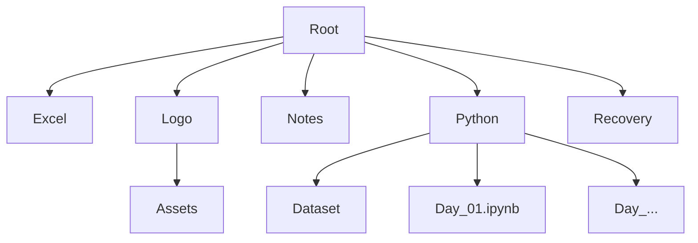

# Data Analytics 2026 Course 📊

<div align="center">
  
  
</div>

<div align="center">


</div>

## 📈 Course Progress

Summary of the daily modules completed in the Python & Excel     curriculum.

| Module | Status | Description |
| :--- | :---: | :--- |
| **Day 01** | ✅ | Introduction & Setup |
| **Day 02** | ✅ | Python Basics |
| **Day 03** | ✅ | Data Structures |
| **Day 04** | ✅ | Control Flow |
| **Day 05** | ✅ | Functions & Modules |
| **Day 06** | ✅ | NumPy Introduction |
| **Day 07** | ✅ | Pandas Basics |
| **Day 08** | ✅ | Data Cleaning |
| **Day 09** | ✅ | Data Visualization |
| **Day 10** | ✅ | Advanced Analysis |
| **Day 11** | ✅ | Time Series and Graph Plotting |
| **Day 12** | ✅ | Naive Bayes and SVM |
| **Day 13** | ✅ | Basics of Excel |
| **Day 14** | ✅ | Charts, Text and Date Functions |
| **Day 15** | 🚧 | *Current Focus* |

## 🗂️ Directory Structure

The project is organized into the following main directories:



### File Tree
```text
Data_Analytics_2026(Course)/
├── 📂 Excel/          # Excel resources and sheets
│   ├── 📊 DAY 13 _ Date _ 03rd Feb 2026.xlsx
│   └── � DAY 14_Date_04th Feb 2026.xlsx
├── �📂 Logo/           # Project logos and branding assets
├── 📂 Notes/          # Course notes and documentation
├── 📂 Python/         # Jupyter Notebooks (Day 01 - Day 12)
│   ├── 📂 Dataset/    # Data files used in notebooks
│   ├── 📜 Day_01.ipynb
│   ├── 📜 Day_02.ipynb
│   ├── 📜 Day_03.ipynb
│   ├── 📜 Day_04.ipynb
│   ├── 📜 Day_05.ipynb
│   ├── 📜 Day_06.ipynb
│   ├── 📜 Day_07.ipynb
│   ├── 📜 Day_08.ipynb
│   ├── 📜 Day_09.ipynb
│   ├── 📜 Day_10.ipynb
│   ├── 📜 Day_11.ipynb
│   └── 📜 Day_12.ipynb
└── 📂 Recovery/       # Backup and recovery files
```

## 🚀 Plan

- [ ] Complete Day 12 module
- [ ] Review and refactor previous days
- [ ] Add more comprehensive tests for data validation
- [ ] Integrate advanced Machine Learning modules

---
*Last Updated: 05th Feb 2026 08:21:47 PM*
