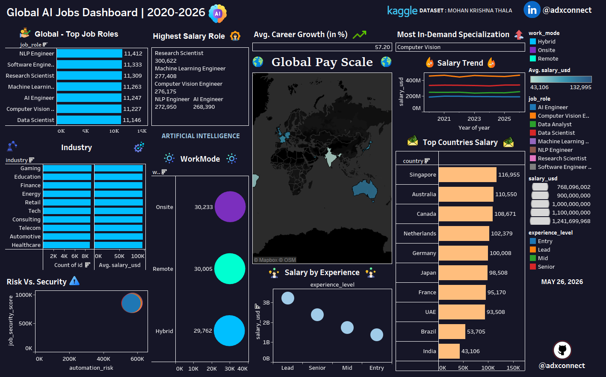
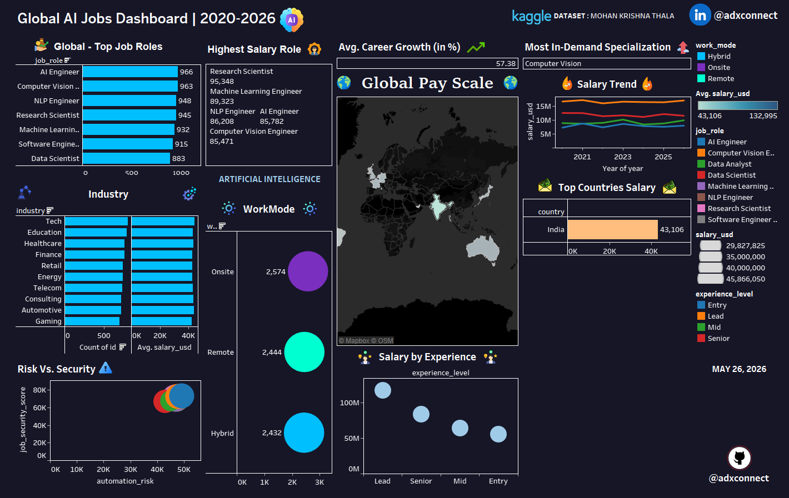
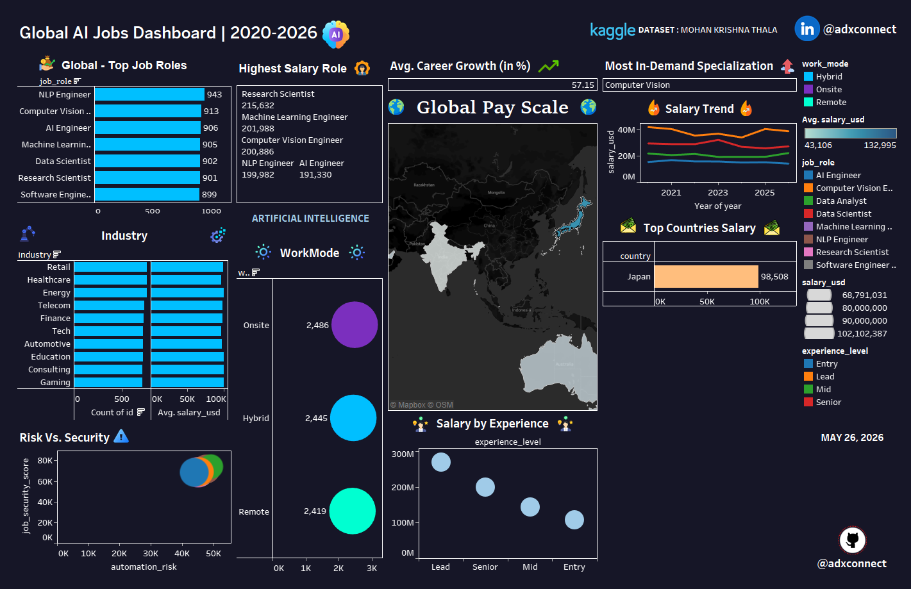
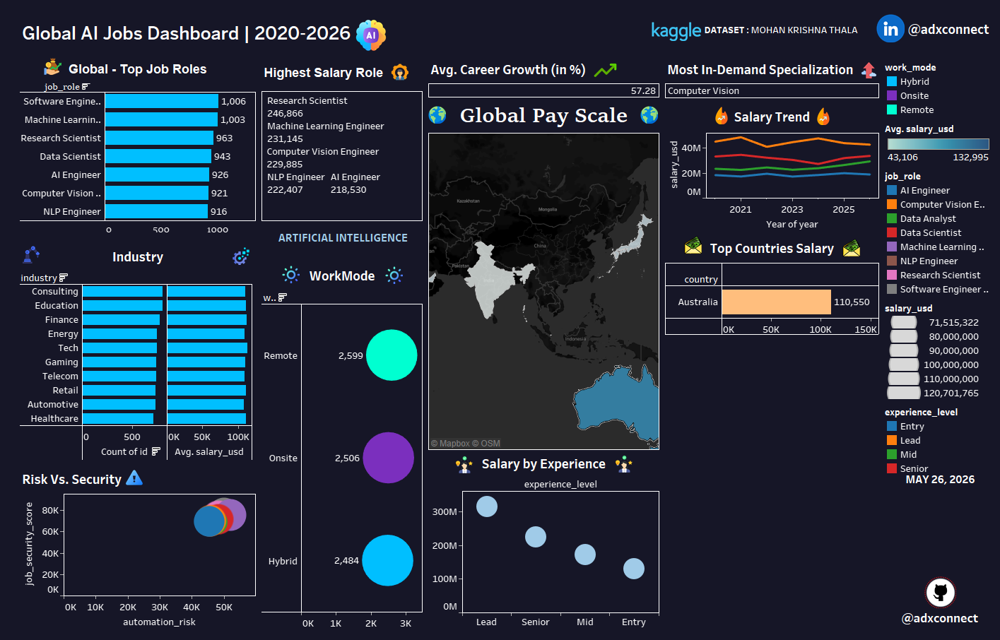
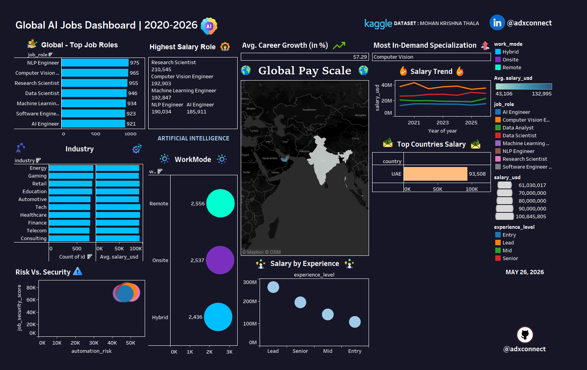
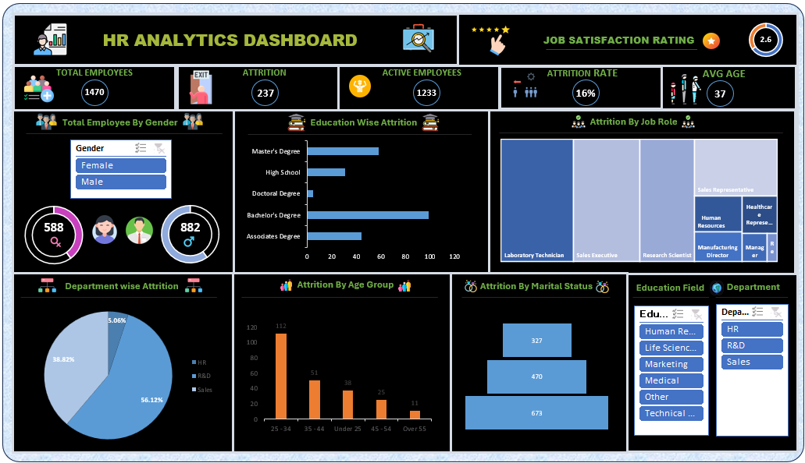
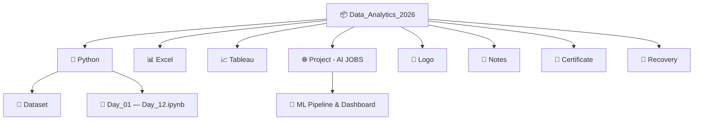

<div align="center">

<!-- ═══════════════════════════════════════════════════════════════════════ -->
<!--                        ✨ HERO SECTION ✨                            -->
<!-- ═══════════════════════════════════════════════════════════════════════ -->


</div>

<!-- ═══════════════════════════════════════════════════════════════════════ -->
<!--                     🏛️ INSTITUTIONAL LOGOS                           -->
<!-- ═══════════════════════════════════════════════════════════════════════ -->

<div align="center">
  <br/>
  <a href="https://bcrec.ac.in">
    
  </a>
  &nbsp;&nbsp;&nbsp;&nbsp;&nbsp;&nbsp;&nbsp;&nbsp;
  <a href="https://www.msme.gov.in">
    
  </a>
  <br/><br/>

  <samp><b>Dr. B.C. Roy Engineering College, Durgapur</b> &nbsp;×&nbsp; <b>MSME-TC CTTC, Bhubaneswar</b></samp>
  <br/>
  <sub>Ministry of Micro, Small & Medium Enterprises • Government of India</sub>

  <br/><br/>

</div>

<!-- ═══════════════════════════════════════════════════════════════════════ -->
<!--                      🛡️ TECHNOLOGY BADGES                            -->
<!-- ═══════════════════════════════════════════════════════════════════════ -->

<div align="center">


</div>

<br/>

<!-- ═══════════════════════════════════════════════════════════════════════ -->
<!--                       📋 ABOUT THE PROGRAMME                         -->
<!-- ═══════════════════════════════════════════════════════════════════════ -->

<div align="center">
<table>
<tr>
<td>

### 📋 &nbsp; About the Programme

This repository documents the complete journey through the **Entrepreneurship-cum-Skill Development Programme (E-SDP)** on **Data Analytics**, organized by **MSME-TC CTTC, Bhubaneswar** at **Dr. B.C. Roy Engineering College, Durgapur** from **15th January 2026 to 26th February 2026**.

The programme covered **Python Programming**, **Machine Learning (Naive Bayes & SVM)**, **Excel Analytics**, **Tableau**, and **Power BI** — culminating in a capstone **Global AI Jobs Dashboard** project built with real-world Kaggle data.

</td>
</tr>
</table>
</div>

<br/>

---

<!-- ═══════════════════════════════════════════════════════════════════════ -->
<!--                      📈 COURSE PROGRESS TRACKER                       -->
<!-- ═══════════════════════════════════════════════════════════════════════ -->

##  &nbsp; Course Progress

<details open>
<summary><b>📅 Daily Module Breakdown</b> &nbsp; <code>18 Days • 6 Weeks</code></summary>

<br/>

| # | Module | Status | Topic | Tools Used |
|:---:|:---|:---:|:---|:---|
| 01 | **Day 01** | ✅ | Introduction & Setup | `Python`, `Jupyter` |
| 02 | **Day 02** | ✅ | Python Basics | `Python` |
| 03 | **Day 03** | ✅ | Data Structures | `Python` |
| 04 | **Day 04** | ✅ | Control Flow | `Python` |
| 05 | **Day 05** | ✅ | Functions & Modules | `Python` |
| 06 | **Day 06** | ✅ | NumPy Introduction | `NumPy` |
| 07 | **Day 07** | ✅ | Pandas Basics | `Pandas` |
| 08 | **Day 08** | ✅ | Data Cleaning | `Pandas` |
| 09 | **Day 09** | ✅ | Data Visualization | `Matplotlib`, `Seaborn` |
| 10 | **Day 10** | ✅ | Advanced Analysis | `Pandas`, `NumPy` |
| 11 | **Day 11** | ✅ | Time Series & Graph Plotting | `Matplotlib` |
| 12 | **Day 12** | ✅ | Naive Bayes & SVM | `Scikit-Learn` |
| 13 | **Day 13** | ✅ | Basics of Excel | `Excel` |
| 14 | **Day 14** | ✅ | Charts, Text & Date Functions | `Excel` |
| 15 | **Day 15** | ✅ | Advanced Excel (TRIM, Flash Fill, etc.) | `Excel` |
| 16 | **Day 16** | ✅ | Dashboard — *HR Analytics* | `Excel` |
| 17 | **Day 17** | ✅ | Tableau Dashboard | `Tableau` |
| 18 | **Day 18** | 🚧 | Power BI | `Power BI` |

</details>

<br/>

---

<!-- ═══════════════════════════════════════════════════════════════════════ -->
<!--              🌐 PROJECT: GLOBAL AI JOBS DASHBOARD                     -->
<!-- ═══════════════════════════════════════════════════════════════════════ -->

## 🌐 &nbsp; Project — Global AI Jobs Dashboard | 2020–2026

<div align="center">


<br/><br/>

> **🔍 An interactive analytics dashboard** exploring **90,000+ AI job listings** across **10+ countries**, analyzing salary trends, job roles, work modes, industry distributions, and experience-level breakdowns — powered by a **Kaggle dataset** by Mohan Krishna Thala.

</div>

<br/>

### 📊 Dashboard Snapshots

<div align="center">

<!-- ─── 🌍 GLOBAL VIEW ─── -->
<details open>
<summary><b>🌍 &nbsp; Global Overview</b></summary>
<br/>

<br/><br/>
<sub>🔹 90K+ jobs analyzed &nbsp;•&nbsp; Top roles: NLP Engineer, Software Engineer, Research Scientist &nbsp;•&nbsp; Avg. Career Growth: 57.20%</sub>
</details>

<br/>

<!-- ─── 🇮🇳 INDIA VIEW ─── -->
<details>
<summary><b>🇮🇳 &nbsp; India Focus</b></summary>
<br/>

<br/><br/>
<sub>🔹 7,450+ AI jobs in India &nbsp;•&nbsp; Avg. Salary: $43,106 &nbsp;•&nbsp; Top role: AI Engineer</sub>
</details>

<br/>

<!-- ─── 🌏 ASIA-PACIFIC VIEW ─── -->
<details>
<summary><b>🌏 &nbsp; Asia-Pacific Region</b></summary>
<br/>

<br/><br/>
<sub>🔹 Japan leads at $98,508 avg. salary &nbsp;•&nbsp; NLP Engineer dominates &nbsp;•&nbsp; Retail tops industry hiring</sub>
</details>

<br/>

<!-- ─── 🇦🇺 AUSTRALIA VIEW ─── -->
<details>
<summary><b>🇦🇺 &nbsp; Australia & Oceania</b></summary>
<br/>

<br/><br/>
<sub>🔹 Australia avg. salary: $110,550 &nbsp;•&nbsp; Remote mode dominates &nbsp;•&nbsp; Consulting leads industry</sub>
</details>

<br/>

<!-- ─── 🇦🇪 UAE & MIDDLE EAST VIEW ─── -->
<details>
<summary><b>🇦🇪 &nbsp; UAE & Middle East</b></summary>
<br/>

<br/><br/>
<sub>🔹 UAE avg. salary: $93,508 &nbsp;•&nbsp; Energy sector leads &nbsp;•&nbsp; NLP Engineer is top role</sub>
</details>

</div>

<br/>

---

<!-- ═══════════════════════════════════════════════════════════════════════ -->
<!--              🎥 YOUTUBE DEMONSTRATION                                 -->
<!-- ═══════════════════════════════════════════════════════════════════════ -->

## 🎥 &nbsp; Dashboard Demonstration

<div align="center">

<a href="https://youtu.be/Dw5rzNcjCO4">
  
</a>

<br/><br/>

<a href="https://youtu.be/Dw5rzNcjCO4">
  
</a>

<br/><br/>

<sub>📺 &nbsp; A complete walkthrough of the <b>Global AI Jobs Dashboard</b> — covering filters, regional drill-downs, salary analytics, and interactive features.</sub>

</div>

<br/>

---

<!-- ═══════════════════════════════════════════════════════════════════════ -->
<!--              🏆 HR ANALYTICS DASHBOARD (EXCEL)                        -->
<!-- ═══════════════════════════════════════════════════════════════════════ -->

## 🏆 &nbsp; Project 01 — HR Analytics Dashboard (Excel)

<div align="center">
  
  <br/><br/>
  <sub>📊 &nbsp; Built on Day 16 using advanced Excel techniques — Pivot Tables, Conditional Formatting, and Dynamic Charts.</sub>
</div>

<br/>

---

<!-- ═══════════════════════════════════════════════════════════════════════ -->
<!--              📜 CERTIFICATE OF PARTICIPATION                          -->
<!-- ═══════════════════════════════════════════════════════════════════════ -->

## 📜 &nbsp; Certificate of Participation

<div align="center">

<table>
<tr>
<td align="center">


&nbsp;

&nbsp;


<br/><br/>


<br/><br/>

| Detail | Information |
|:---|:---|
| **Certificate No.** | `78502/E-SDP/2025-26/25` |
| **Participant** | Mr. Aniket Banerjee |
| **Programme** | Entrepreneurship-cum-Skill Development Programme (E-SDP) |
| **Subject** | Data Analytics |
| **Duration** | 15/01/2026 to 26/02/2026 |
| **Venue** | Dr. B.C. Roy Engineering College, Durgapur |
| **Issuing Authority** | MSME-TC — CTTC, Bhubaneswar |
| **Date of Issue** | 09-03-2026 |

</td>
</tr>
</table>

</div>

<br/>

---

<!-- ═══════════════════════════════════════════════════════════════════════ -->
<!--                      🗂️ DIRECTORY STRUCTURE                          -->
<!-- ═══════════════════════════════════════════════════════════════════════ -->

## 🗂️ &nbsp; Repository Structure

<details>
<summary><b>📁 Click to expand full directory tree</b></summary>

<br/>


```mermaid
graph TD;
    Root["📦 Data_Analytics_2026"]
    Root --> Python["🐍 Python"]
    Root --> Excel["📊 Excel"]
    Root --> Tableau["📈 Tableau"]
    Root --> Project["🌐 Project - AI JOBS"]
    Root --> Logo["🎨 Logo"]
    Root --> Notes["📝 Notes"]
    Root --> Certificate["📜 Certificate"]
    Root --> Recovery["💾 Recovery"]

    Python --> Dataset["📂 Dataset"]
    Python --> Notebooks["📜 Day_01 — Day_12.ipynb"]
    Project --> ML["🤖 ML Pipeline & Dashboard"]
```

```text
Data_Analytics_2026(Course)/
│
├── 📂 Python/                          # Jupyter Notebooks (Day 01 — Day 12)
│   ├── 📂 Dataset/                     # Data files used in notebooks
│   ├── 📜 Day_01.ipynb                 # Introduction & Setup
│   ├── 📜 Day_02.ipynb                 # Python Basics
│   ├── 📜 Day_03.ipynb                 # Data Structures
│   ├── 📜 Day_04.ipynb                 # Control Flow
│   ├── 📜 Day_05.ipynb                 # Functions & Modules
│   ├── 📜 Day_06.ipynb                 # NumPy Introduction
│   ├── 📜 Day_07.ipynb                 # Pandas Basics
│   ├── 📜 Day_08.ipynb                 # Data Cleaning
│   ├── 📜 Day_09.ipynb                 # Data Visualization
│   ├── 📜 Day_10.ipynb                 # Advanced Analysis
│   ├── 📜 Day_11.ipynb                 # Time Series & Graph Plotting
│   └── 📜 Day_12.ipynb                 # Naive Bayes & SVM
│
├── 📂 Excel/                           # Excel resources & sheets
│   ├── 📊 DAY 13 — Basics of Excel
│   ├── 📊 DAY 14 — Charts, Text & Date Functions
│   ├── 📊 DAY 15 — Advanced Excel Functions
│   └── 📊 DAY 16 — HR Analytics Dashboard
│
├── 📂 Tableau/                         # Tableau workbooks
│   └── 📊 DAY 17 — Tableau Dashboard
│
├── 📂 Project - AI JOBS (DASHBOARD)/   # 🌐 Capstone Project
│   ├── 🤖 ml_pipeline.py              # ML pipeline (Scikit-Learn)
│   ├── 📊 ml_dashboard.py             # Streamlit dashboard
│   ├── 📓 ML.ipynb                    # Analysis notebook
│   ├── 📂 ml_artifacts/               # Trained model artifacts
│   ├── 📄 global_ai_jobs.csv          # Kaggle dataset (17.6 MB)
│   └── 📄 requirements.txt            # Dependencies
│
├── 📂 Logo/                            # 🎨 Branding & dashboard screenshots
│   ├── 🏛️ BCREC_Website.png           # College logo
│   ├── 🏛️ MSME_CTTC.png              # MSME logo
│   ├── 📊 Dashboard_HR.png            # HR Dashboard screenshot
│   ├── 🌍 1.png                       # AI Dashboard — Global
│   ├── 🇮🇳 2.png                       # AI Dashboard — India
│   ├── 🌏 3.png                       # AI Dashboard — Asia-Pacific
│   ├── 🇦🇺 4.png                       # AI Dashboard — Australia
│   └── 🇦🇪 5.png                       # AI Dashboard — UAE
│
├── 📂 Certificate(Govt of India- MSME)/ # 📜 Official MSME Certificate
│   └── 🏅 Certificate.jpg
│
├── 📂 Notes/                           # 📝 Course notes & documentation
├── 📂 Recovery/                        # 💾 Backup & recovery files
└── 📄 README.md                        # ← You are here
```

</details>

<br/>

---

<!-- ═══════════════════════════════════════════════════════════════════════ -->
<!--                       🚀 ROADMAP & FUTURE PLANS                      -->
<!-- ═══════════════════════════════════════════════════════════════════════ -->

## 🚀 &nbsp; Roadmap

- [x] Complete Python fundamentals (Day 01 — 05)
- [x] Master data libraries — NumPy, Pandas, Matplotlib (Day 06 — 11)
- [x] Implement ML models — Naive Bayes & SVM (Day 12)
- [x] Excel analytics & HR Dashboard (Day 13 — 16)
- [x] Tableau Dashboard (Day 17)
- [x] Build Global AI Jobs Dashboard (Capstone)
- [ ] Complete Power BI module (Day 18)
- [ ] Add advanced ML models (Random Forest, XGBoost)
- [ ] Deploy dashboard live with Streamlit Cloud
- [ ] Comprehensive test suite for data validation

<br/>

---

<!-- ═══════════════════════════════════════════════════════════════════════ -->
<!--                           📬 CONNECT                                  -->
<!-- ═══════════════════════════════════════════════════════════════════════ -->

<div align="center">

### 🤝 &nbsp; Connect

<a href="https://www.linkedin.com/in/adxconnect">
  
</a>
&nbsp;
<a href="https://github.com/adxconnect">
  
</a>

<br/><br/>

<sub>⭐ If you found this repository helpful, consider giving it a star!</sub>

</div>

<br/>

---

<div align="center">


<sub>Made with ❤️ by <b>Aniket Banerjee</b> &nbsp;|&nbsp; <b>@adxconnect</b> &nbsp;|&nbsp; Last Updated: 27th May 2026</sub>

</div>
